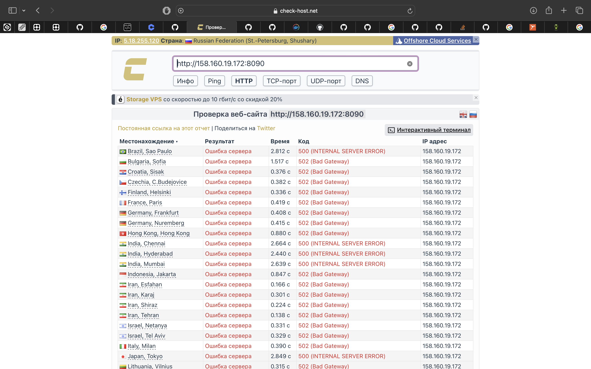

# Домашнее задание к занятию 5. «Практическое применение Docker»

## Задача 0

1. docker-compose --version
```
Command 'docker-compose' not found, but can be installed with:
sudo snap install docker          # version 24.0.5, or
sudo apt  install docker-compose  # version 1.29.2-6
See 'snap info docker' for additional versions.
```

2. docker compose version
```
Docker Compose version v2.29.7
```

## Задача 1

1. Сделала fork, оставила название main.py 

2. [Dockerfile.python](Dockerfile.python) и [.dockerignore](.dockerignore) создала, сборка работает корректно 
```
docker build -t my_python_app -f Dockerfile.python .
[+] Building 22.1s (9/9) FINISHED 
```
```
docker images
REPOSITORY      TAG       IMAGE ID       CREATED              SIZE
my_python_app   latest    01572cb25fa6   About a minute ago   365MB
```

## Задача 3

Создала файл [compose.yaml](compose.yaml) со всеми условиями

Проект запустился
```
docker compose up -d
[+] Running 5/5

 ✔ Network shvirtd-example-python_backend            Created
 ✔ Container shvirtd-example-python-reverse-proxy-1  Started
 ✔ Container shvirtd-example-python-web-1            Started
 ✔ Container shvirtd-example-python-db-1             Started
 ✔ Container shvirtd-example-python-ingress-proxy-1  Started
``` 
```
curl -L http://127.0.0.1:8090
TIME: 2024-10-28 12:55:03, IP: 127.0.0.1(venv)
```


## Задача 4
1. 2. ВМ создала

3. [bash-скрипт](start_project.sh) написала

4. На сайте https://check-host.net/check-http проверку запустила 


5. Fork-репозиторий: https://github.com/KuzminaAn/shvirtd-example-python.git


## Задача 6

1. docker образ скачала 


2. Cохранила образ в файл с помощью docker save


3. Использование dive 
```
docker run --rm -it \
  -v /var/run/docker.sock:/var/run/docker.sock \
  wagoodman/dive:latest hashicorp/terraform:latest
```


sha256:c3c3a5978391c2884975a1e49c4d3ee1e29dac201a59bf27685a1b750ad5e64a

4. Копирование бинарного файла 


## Задача 6.1


